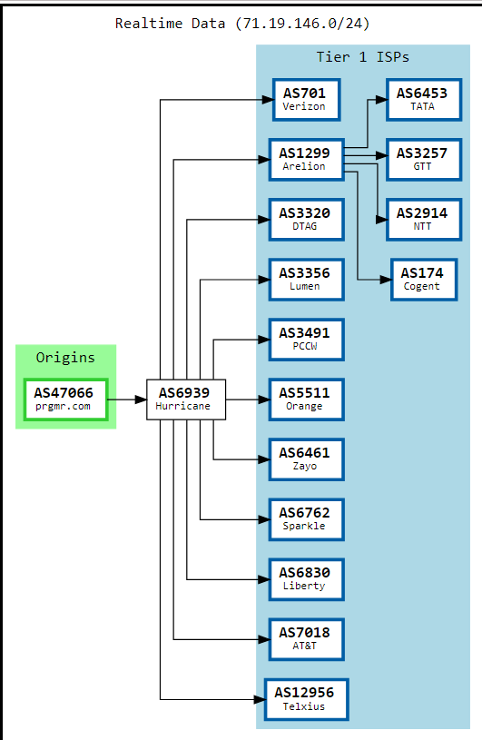

# Lab 1 - Computer Networks 24S, Kirsten Mayland

# Exercise 1
## Part A
### <ins>IP address of packetbender.com</ins>: 
71.19.146.5
### <ins>Network</ins>: 
AS47066 
### <ins>Autonomous System Name/ Hosting provider</ins>:
prgmr.com, Inc. (PRGMR) (currently rebranded to Tornado VPS, Inc)
* 705 S. Mustang Rd. #300, Yukon OK, 73099  - US

### <ins>Organizations/AS providing connectivity to hoster</ins>:
primarily Hurricane Electric LLC at AS6939 but also all the Tier 1 ISPs as seen below



###### Also, the domain name packetbender.com is registered by GoDaddy.

## Part B
Using ping and TTL on my computer, I found that packetbender.com is ~16 hops away. If I send a ping with a TTL of 15, it fails, but starts going through with a TTL of 16+. Traceroute --icmp packetbender.com also showed it 16 hops away as seen below

```bash
kirstenm@DESKTOP-KirstenM:~$ traceroute --icmp packetbender.com
traceroute to packetbender.com (71.19.146.5), 64 hops max
  1   172.29.0.1  0.339ms  0.268ms  0.287ms 
  2   10.132.0.1  5.436ms  3.177ms  1.913ms 
  3   *  *  * 
  4   *  *  * 
  5   *  *  * 
  6   *  *  * 
  7   *  *  * 
  8   *  *  * 
  9   *  *  * 
 10   *  *  * 
 11   *  *  * 
 12   *  *  * 
 13   *  *  * 
 14   *  *  * 
 15   *  *  * 
 16   71.19.146.5  147.830ms  255.377ms  256.593ms 
```

## Part C
First:
```bash
kirstenm@DESKTOP-KirstenM:~$ xxd < id
00000000: 4944 3d66 3030 3536 3367 78              ID=f00563gx
```
Then:
```bash
kirstenm@DESKTOP-KirstenM:~$ ping packetbender.com -t 46 -p 49443d6630303536336778 -c 1
PATTERN: 0x49443d6630303536336778
PING packetbender.com (71.19.146.5) 56(84) bytes of data.
79 bytes from packetbender.vm.tornadovps.net (71.19.146.5): icmp_seq=1 ttl=52 time=196 ms

--- packetbender.com ping statistics ---
1 packets transmitted, 1 received, 0% packet loss, time 0ms
rtt min/avg/max/mdev = 196.444/196.444/196.444/0.000 ms
```
Using Wireshark, I captured the packet and saw that the TOKEN = c9VocB/J (see `Lab1-1cToken.pcapng`)

# Exercise 2

### <ins>Over Wifi</ins>:
#### For packet captures, see `Lab1-2OverWifi.pcapng`. 
__Type 0/code 0__ (valid echo reply): 
```bash
kirstenm@DESKTOP-KirstenM:~$ ping 8.8.8.8 -c 1
```
__Type 11/code 0__ (time-to-live exceeded in transit) and __Type 3/code 3__ (destination unreachable, port unreachable):
```bash
kirstenm@DESKTOP-KirstenM:~$ traceroute dartmouth.edu
```

### <ins>Over vEthernet(WSL)</ins>:
#### For packet captures, see `Lab1-2OverEthernet(WSL).pcapng`. 
__Type 14/code 0__ (valid timestamp reply):
```bash
sudo hping3 172.29.0.1 --icmp --icmp-ts -V -c 1
```    
Credit for above query: https://serverfault.com/questions/710156/icmp-how-to-send-a-timestamp-and-netmask-request \
\
I discovered interesting an hping3 fact, that -C (number) sets the icmp type and -K (number) sets the icmp code, so I was able to just create whatever IMCP codes I wanted as evidenced below. 
#### For packet captures, see `Lab1-2ManuallyCreated.pcapng`. 
__Type 3/code 0__ (destination unreachable, network unreachable)
```bash
sudo hping3 -c 1 -C 3 -K 0 172.26.83.109
```
__Type 5/code 1__ (redirect datagram from the host)
```bash
sudo hping3 -c 1 -C 5 -K 1 172.26.83.109
```


# Exercise 3
## Step One
```bash
[kirsten@thepond ~]$ netstat -n -l
Active Internet connections (only servers)
Proto Recv-Q Send-Q Local Address           Foreign Address         State      
tcp        0      0 0.0.0.0:106             0.0.0.0:*               LISTEN     
tcp        0      0 0.0.0.0:603             0.0.0.0:*               LISTEN     
tcp6       0      0 :::106                  :::*                    LISTEN     
udp        0      0 0.0.0.0:603             0.0.0.0:*         
Active UNIX domain sockets (only servers)
Proto RefCnt Flags       Type       State         I-Node   Path
<skipped>
```
Therefore we see that the bot is listening on port 603 because it's the only one listening on both tcp and udp.
## Step Two
Using `lab1_rightmessage.py`, I partially brute forced the port. I intitially tried to do a full brute force method, but the error messages made it more annoying/more work than the method I ended up with, which was brute forcing only one byte of the 10 bytes until I found the correct one. Then based on the corresponding new error message, I would choose a different byte to brute force.

### History of byte discovery:
[0] Error: Message is not 10 bytes \
[0, 0, 0, 0, 0, 0, 0, 0, 0, 0] Error: Message does not start with magic byte \
[9, 0, 0, 0, 0, 0, 0, 0, 0, 0] Error: Message does not start with magic 3 bytes \
[9, 0, 255, 0, 0, 0, 0, 0, 0, 0] Error: Message payload does not contain valid net_id \
[9, 0, 255, ord('f'), ord('0'), ord('0'), ord('5'), ord('6'), ord('3'), ord('g')] Error: Incorrect source port. \
^^^ Final correct message

## Step Three
Using `lab1_rightport.py`, I brute forced the correct source ports.
### For TCP:
The source port is 2117 and the token is ca10dc73.
```bash
kirstenm@DESKTOP-KirstenM:~$ cat /home/kirstenm/COURSES/CS60-Networks/lab1/lab1_rightport.py | ssh kirsten@thepond.cs.dartmouth.edu -p 106 python -
Enter passphrase for key '/home/kirstenm/.ssh/id_rsa': 
Error '[Errno 98] Address already in use' occurred when binding to source port 2000
Error '[Errno 98] Address already in use' occurred when binding to source port 2001
Error '[Errno 98] Address already in use' occurred when binding to source port 2002
Found correct source port:  2117
Response: Hello kirsten, your token is: ca10dc73
```
### For UDP:
The source port is 2710 and the token is fbc2a952.
```bash
kirstenm@DESKTOP-KirstenM:~$ cat /home/kirstenm/COURSES/CS60-Networks/lab1/lab1_rightport.py | ssh kirsten@thepond.cs.dartmouth.edu -p 106 python -
Enter passphrase for key '/home/kirstenm/.ssh/id_rsa': 
Found correct source port:  2710
Response: Hello kirsten, your token is: fbc2a952
```